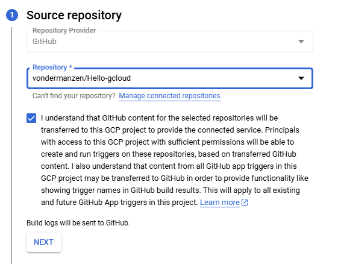

© The Chancellor, Masters and Scholars of The University of Oxford. All rights reserved.

# Explore different providers

This course is available for multiple cloud providers. Choose your preferred platform:

- [Hello Google Cloud](https://github.com/Oxford-Research-Cloud-Competency-Centre/Hello-gcloud)
- [Hello Microsoft Azure](https://github.com/Oxford-Research-Cloud-Competency-Centre/Hello-mazure)
- [Hello Amazon Web Services](https://github.com/Oxford-Research-Cloud-Competency-Centre/Hello-aws) (⭐ Most popular)
- Hello Oracle Cloud *(Coming Soon)*
- Hello IBM Cloud *(Coming Soon)*
- Hello Tencent Cloud *(Coming Soon)*
- Hello Alibaba Cloud *(Coming Soon)*
- Hello Baidu AI Cloud *(Coming Soon)*

*Note: Entries marked with "Coming Soon" are planned versions that are currently under development.*

# Instructions

Step 1. Fork (or make a copy of) this repository

***
<details>
<summary>Step 2. Go to the Google Cloud Console and type "Cloud Run" in the search bar</summary>


***
</details>
<details>
<summary>Step 3. Go to Deploy Container -> Service</summary>


***
</details>
<details>
<summary>Step 4. Select "Continuously deploy from a repository (source or function)" then "Set up with Cloud Build"</summary>


***
</details>
<details>
<summary>Step 5. Select the git repository</summary>



***
</details>
<details>
<summary>Step 6. Select the "Google Cloud's buildpacks" option. Leave all the parameters empty: Cloud Run will figure out on its own that you are using Python.</summary>


***
</details>
<details>
<summary>Step 7. Select the region (europe-west2 in this case), allow unauthenticated invocations, allow internet traffic, then press Create</summary>


***
</details>
Voilà! Access the URL.


# Going further

## Modifying the code

You can commit some changes to your repository and watch how the service is updated automatically. 

## Cleaning up

<details>
<summary>Don't forget to delete the service when you are done.</summary>


</details>

## Adding an API endpoint

<details>
<summary>Add the following code in app.py</summary>

```	
@app.route("/hello_api")
def hello_api():
    return {
		"name": "Wrinkle Five Star",
		"species": "Duck",
		"breed": "American Pekin",
		"hatching_date": "2020-09-09",
		"sex": "Male"
    }
```
</details>
Then test your endpoint


## User interface

<details>
<summary>...</summary>
Missing content
</details>

## Database writing/reading

<details>
<summary>Go to the Google Cloud Console and type "SQL" in the search bar</summary>
Missing content
</details>

## Storage bucket writing/reading

<details>
<summary>Go to the Google Cloud Console and type "buckets" in the search bar</summary>
Missing content
</details>

## Local testing

After a while, it's not fun anymore to wait for deployment. You want to test your changes before. 

<details>
<summary>Step 1. Install git and clone the repository on your local machine</summary>

```	
	git clone {repository_link}
```

***
</details>
<details>
<summary>Step 2. Install Python</summary>

```	
https://www.python.org/downloads/
```

***
</details>
<details>
<summary>Step 3. Install dependencies</summary>

```	
	 py -m pip install flask
```

***
</details>
<details>
<summary>Step 4. Run flask</summary>

```	
	 py -m flask run
```

Open localhost:5000 in your browser.  

***
</details>


